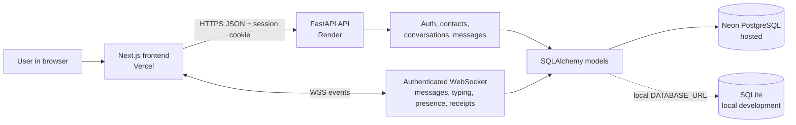

# Signal Clone

A Signal-inspired messaging app built for a full-stack assignment. It includes mocked phone/username authentication, contacts, direct and group conversations, persisted messages, and live updates over WebSockets. OTP verification is fixed for the demo, and messages are **not** protected by real end-to-end encryption.

## Demo

- App: [signal-clone-beige.vercel.app](https://signal-clone-beige.vercel.app/)
- API: [signal-clone-api-osfo.onrender.com](https://signal-clone-api-osfo.onrender.com/)
- Demo OTP: `123456`
- Seeded accounts: `diya`, `alice`, `bob`, and `charlie` (each can sign in with the demo OTP).

Use separate browser profiles or an incognito window to sign in as different demo users and try live messaging. The free Render service can sleep while idle, so its first request may take a little longer.

## Features

- Register with a phone number, display name, and optional avatar; sign in with a username or phone number.
- Mock OTP flow, database-backed sessions, logout, and session persistence through an HTTP-only cookie.
- Search for users, add contacts, create direct chats and groups, and manage group members as an admin.
- Persist messages and message receipts in the database; deliver chat messages, typing, and presence events over WebSockets.
- Search/filter the conversation list, show online state, unread counts, last messages, and timestamps.
- Signal-inspired dark interface, responsive layout, emoji input, settings placeholders, and call/story placeholders.

## Tech stack

- Frontend: Next.js App Router, React, TypeScript
- Backend: Python, FastAPI, SQLAlchemy
- Database: SQLite for local development; PostgreSQL for hosted deployment
- Live messaging: FastAPI WebSockets
- Hosting: Vercel (frontend), Render (API), Neon (hosted PostgreSQL)

## Run locally

Requirements: Node.js/npm and Python 3.10+.

1. Start the backend:

   ```powershell
   cd backend
   python -m venv .venv
   .venv\Scripts\Activate.ps1
   pip install -r requirements.txt
   python seed.py
   uvicorn main:app --reload --port 8000
   ```

   The backend creates `backend/signal.db` by default. To use a different database, set `DATABASE_URL` before starting it.

2. In a second terminal, start the frontend:

   ```powershell
   cd frontend
   npm.cmd install
   Copy-Item .env.example .env.local
   npm.cmd run dev
   ```

3. Open [http://localhost:3000](http://localhost:3000). The frontend uses `http://localhost:8000` by default; change `NEXT_PUBLIC_API_URL` in `frontend/.env.local` if the API runs elsewhere.

To simulate a conversation between two users, sign in as one demo account in a normal browser window and another account in a separate browser profile or incognito window. Open the same direct or group conversation and send messages from either side.

## Deployment

### Backend: Neon + Render

1. Create a Neon PostgreSQL project and copy its **pooled** connection string.
2. In Render, create a Blueprint from this repository. The root `render.yaml` configures the free `signal-clone-api` service from `backend/`.
3. Set the Render environment variables:
   - `DATABASE_URL`: Neon pooled connection string (keep this private).
   - `FRONTEND_ORIGINS`: the production frontend origin, such as `https://signal-clone-beige.vercel.app`.
   - `SEED_DEMO_DATA`: `true` to seed the demo accounts once when the database is empty (configured by the Blueprint).

The Blueprint enables secure cross-site cookies and allows Vercel preview origins. Confirm the service is **Live** at `/` before wiring up the frontend.

### Frontend: Vercel

1. Import the repository into Vercel and set the project root directory to `frontend`.
2. Set `NEXT_PUBLIC_API_URL` to the Render API origin, for example `https://signal-clone-api-osfo.onrender.com` (no trailing slash). This is a public API address, not a secret; the browser needs it to call the backend.
3. Enable the variable for **Production** and **Preview** if you use Vercel preview links, then redeploy.

## Architecture

- `frontend/`: Next.js UI and client-side API/WebSocket connections. `frontend/lib/api.ts` reads `NEXT_PUBLIC_API_URL` and sends cookies with API requests.
- `backend/main.py`: FastAPI app, CORS, table creation, optional demo seeding, and router registration.
- `backend/routes/auth.py`: registration, mock OTP, login/logout, current profile, and session cookie handling.
- `backend/routes/contacts.py`: contact listing, user search, and adding contacts.
- `backend/routes/conversations.py`: conversation list, direct/group creation, group members, and admin membership changes.
- `backend/routes/messages.py`: message history, send, and read receipt endpoints.
- `backend/routes/websocket.py`: authenticated conversation WebSockets for messages, typing, presence, and delivery/read events.
- `backend/models.py`: SQLAlchemy entities; `backend/database.py` selects SQLite or PostgreSQL from `DATABASE_URL`.
- `backend/seed.py`: demo users and sample direct/group conversations.



In production, the HTTP API and WebSocket handler both use the configured PostgreSQL database. Local development defaults to SQLite. WebSocket presence and connection routing live in backend process memory, so this setup is intended for one API instance rather than a horizontally scaled cluster.

## Database schema

| Table | Purpose |
| --- | --- |
| `users` | Username, optional phone, display name, avatar, and last-seen time |
| `sessions` | User session token and expiry; the token is also sent in an HTTP-only cookie |
| `contacts` | User-owned contact relationships |
| `conversations` | Direct or group chat metadata and activity time |
| `conversation_members` | Users in a conversation and their group role (`admin` or `member`) |
| `messages` | Persistent message content, sender, conversation, status, and timestamp |
| `message_receipts` | Per-recipient sent/delivered/read state for messages |

Foreign keys connect messages to their sender and conversation, membership rows to users and conversations, and receipts to messages and users. Group removal updates membership and closes the removed member’s active conversation socket.

## API overview

All HTTP routes are hosted under the API origin and use JSON. Authenticated routes use the session cookie; the browser client sends it with `credentials: "include"`.

| Method | Path | Purpose |
| --- | --- | --- |
| `GET` | `/` | API health response |
| `POST` | `/auth/register` | Request a registration OTP |
| `POST` | `/auth/verify-otp` | Verify OTP, create account, and start session |
| `POST` | `/auth/login/request-otp` | Request a login OTP |
| `POST` | `/auth/login` | Verify OTP and sign in |
| `POST` | `/auth/logout` | End the current session |
| `GET` | `/auth/me` | Get the signed-in user |
| `PATCH` | `/auth/me` | Update profile details |
| `GET`, `POST` | `/contacts/` | List or add contacts |
| `GET` | `/contacts/search?q=...` | Search users |
| `GET` | `/conversations/` | List conversations |
| `POST` | `/conversations/direct` | Open or create a direct conversation |
| `POST` | `/conversations/groups` | Create a group |
| `GET` | `/conversations/{id}/members` | List group members |
| `POST` | `/conversations/{id}/members` | Add a group member (admin only) |
| `DELETE` | `/conversations/{id}/members/{member_id}` | Remove a group member (admin only) |
| `GET`, `POST` | `/conversations/{id}/messages` | Read history or send a message |
| `POST` | `/conversations/{id}/read` | Mark received messages as read |
| WebSocket | `/ws/{conversation_id}` | Live conversation events |

The mock OTP is `123456`. This is demo-only behavior: there is no SMS provider, password authentication, or real end-to-end encryption.

## Assumptions / Mocked Data / Notes

- **Verification:** Any account can use the fixed OTP `123456`. No SMS or phone ownership check is performed.
- **Demo data:** `diya`, `alice`, `bob`, and `charlie` are seeded into a fresh, empty database. Hosted seeding runs only when `SEED_DEMO_DATA=true` and there are no users yet; it does not reset or overwrite an existing database.
- **Security and encryption:** Sessions use an HTTP-only cookie, but this is an assignment demo and has not had a security audit. Messages are stored as readable text; Signal’s end-to-end encryption protocol and key exchange are not implemented.
- **Live state:** Messages are persisted through the API/database and broadcast over WebSockets. Online status reflects active WebSocket connections; it is a simple demo presence signal, not a guaranteed availability indicator.
- **Hosting:** Local development uses SQLite. For hosted persistence, the Render service must use Neon PostgreSQL through `DATABASE_URL`; Render’s free filesystem is not durable across restarts. The in-memory WebSocket connection manager is designed for this single-instance demo and does not coordinate multiple backend instances.
- **Placeholders:** Voice/video calls, stories, and linked devices are not implemented. Avatar upload is stored as a data URL; large files and general message attachments are not supported.
- **Time:** Message timestamps are stored by the backend in UTC and formatted for display in the browser’s local time zone.

## Checks

From `frontend/`:

```powershell
npm.cmd run lint
npm.cmd run build
```

From `backend/`:

```powershell
python -m compileall -q .
```

There is no automated backend test suite configured yet. `backend/test_websocket.py` is a manual WebSocket script and requires a running local API plus a valid session cookie; it is not a standalone test runner.
